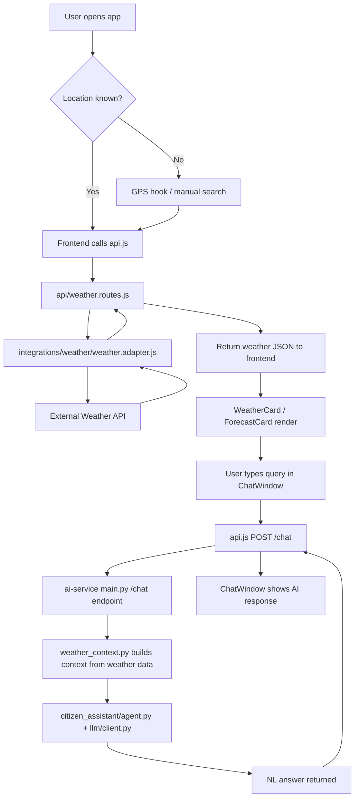

## Backend — `services/api/`

| File | Purpose |
|---|---|
| `src/app.js` | Express app init, middleware mount |
| `src/server.js` | HTTP server boot, port listen |
| `src/modules/auth/auth.routes.js` | Login/register/refresh routes |
| `src/modules/auth/auth.controller.js` | Req/res handlers for auth |
| `src/modules/auth/auth.service.js` | Hash pw, JWT issue/verify logic |
| `src/modules/users/user.routes.js` | Profile get/update routes |
| `src/modules/users/user.controller.js` | User req handlers |
| `src/modules/locations/location.routes.js` | Save/search location routes |
| `src/modules/locations/location.service.js` | Location CRUD, geocode calls |
| `src/rest/weather.routes.js` | Current/hourly/daily weather endpoints |
| `src/middleware/auth.middleware.js` | JWT check on protected routes |
| `src/middleware/error.middleware.js` | Central error handler |
| `prisma/schema.prisma` | User, Location, SavedLocation models |

## Weather integration — `integrations/weather/`

| File | Purpose |
|---|---|
| `weather.client.js` | Raw HTTP calls to weather provider (IMD/OpenWeather) |
| `weather.adapter.js` | Normalize provider response → app's weather shape |
| `index.js` | Export adapter, hide provider detail from rest of app |

## AI service — `services/ai-service/` (Python, minimal Phase 1)

| File | Purpose |
|---|---|
| `main.py` | FastAPI entry, chat endpoint |
| `agents/citizen_assistant/agent.py` | Turns user query + weather data → NL answer |
| `services/weather_context.py` | Builds prompt context from weather JSON |
| `llm/client.py` | LLM API wrapper (model call, prompt template) |
| `services/session.py` | Follow-up context / convo memory per session |

## Frontend — `apps/web-app/`

| File | Purpose |
|---|---|
| `src/pages/Dashboard.jsx` | Main weather dashboard screen |
| `src/pages/Chat.jsx` | Chat screen |
| `src/components/WeatherCard.jsx` | Current weather display |
| `src/components/ForecastCard.jsx` | Hourly/daily forecast list |
| `src/components/LocationSearch.jsx` | City/PIN search input |
| `src/components/ChatWindow.jsx` | Chat msg list + input |
| `src/context/AuthContext.jsx` | Auth state provider |
| `src/hooks/useGeolocation.js` | GPS location hook |
| `src/services/api.js` | Axios instance, API calls |

## Shared — `packages/shared-types/`

| File | Purpose |
|---|---|
| `weather.types.ts` | Weather/forecast shape shared FE+BE |
| `user.types.ts` | User/auth shape shared FE+BE |

## Workflow (Phase 1)

Auth flow runs parallel, gates Dashboard/Chat access via `auth.middleware.js` + `AuthContext.jsx`.