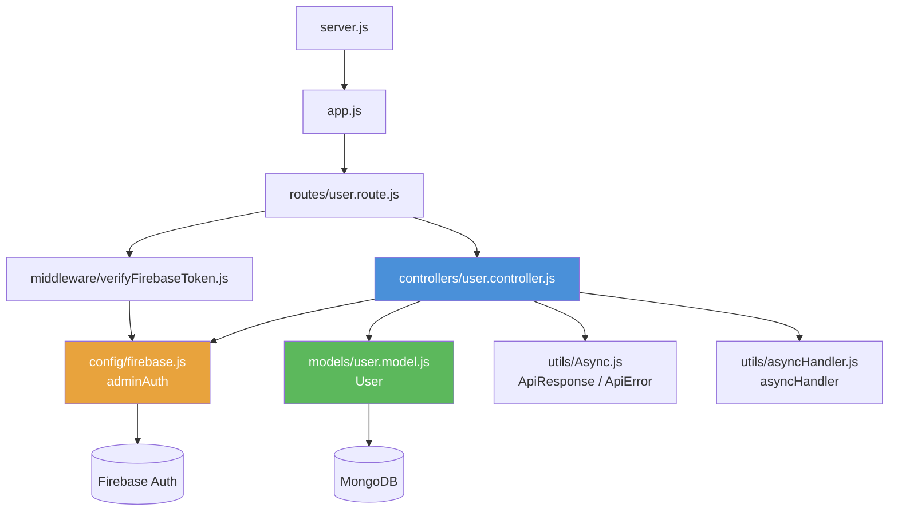
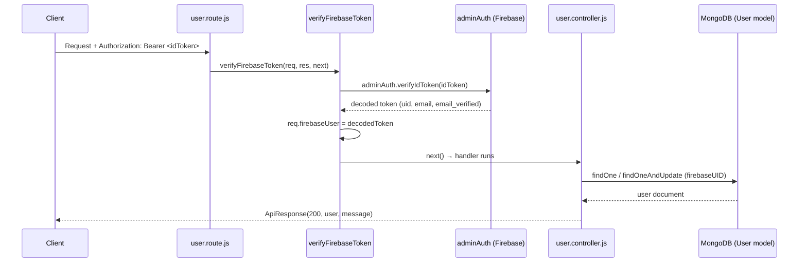
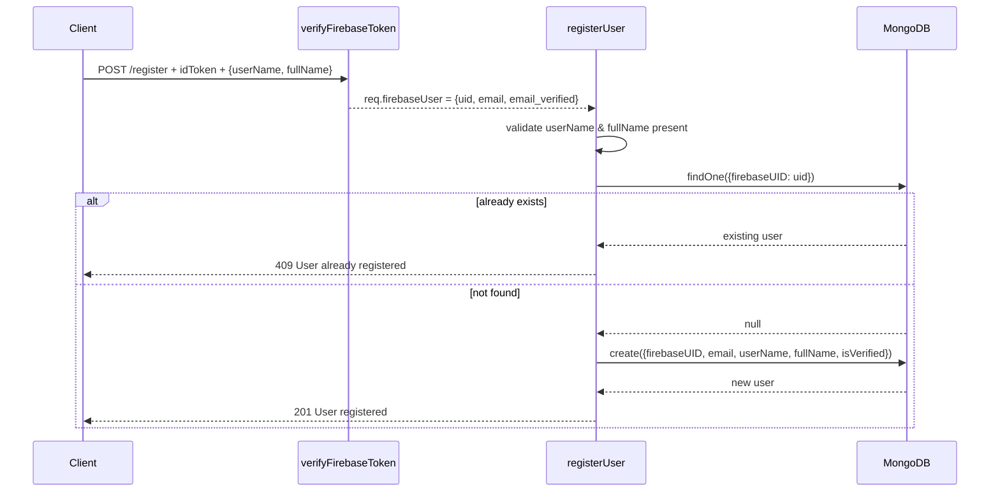
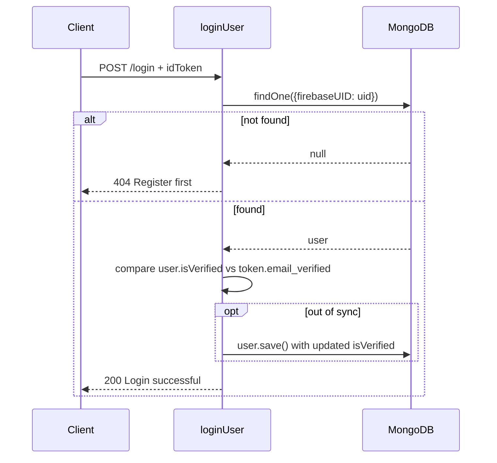
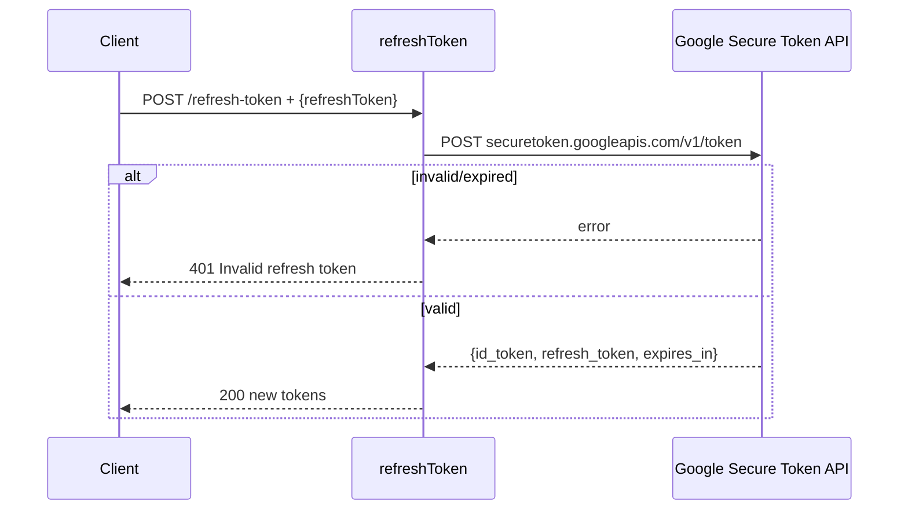
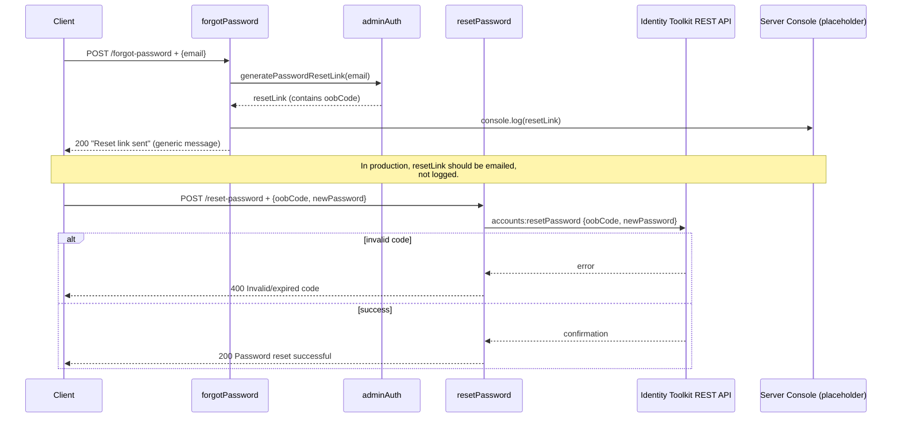
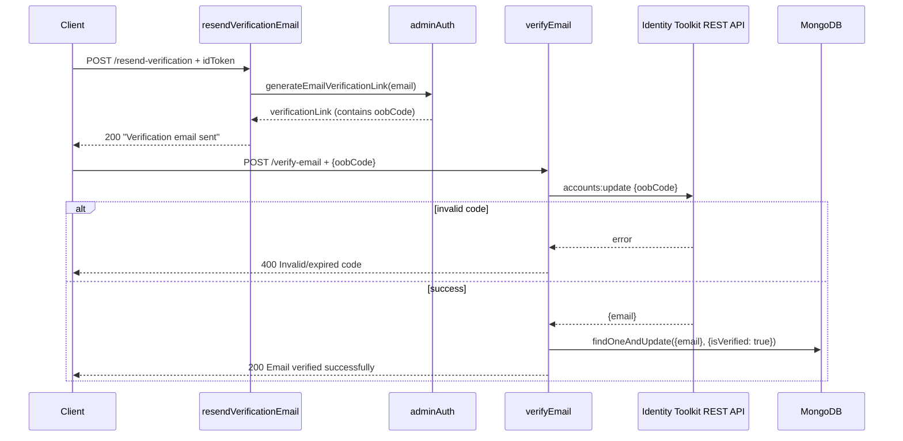
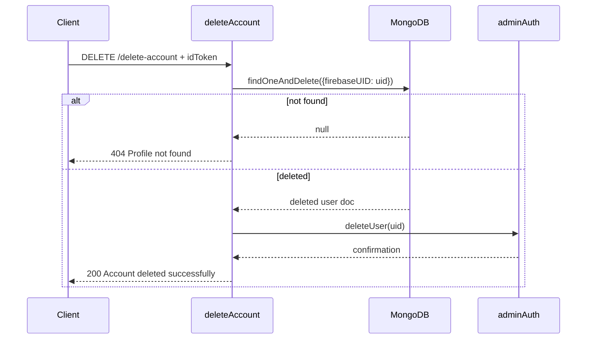

# user.controller.js — Explanation

This controller handles all user-authentication-related logic for the API. It works together with **Firebase Admin SDK** (identity/auth) and **MongoDB via Mongoose** (app-level profile data). Every handler is wrapped in `asyncHandler` so thrown errors are automatically passed to Express's error middleware via `next(err)`.

## Imports

```js
import { User } from "../models/user.model.js";
import { ApiResponse, ApiError } from "../utils/Async.js";
import { asyncHandler } from "../utils/asyncHandler.js";
import adminAuth from "../config/firebase.js";
```

- `User` — Mongoose model, stores the app-level profile (`firebaseUID`, `userName`, `fullName`, `email`, `isVerified`).
- `ApiResponse` / `ApiError` — standard shape for success/error JSON responses.
- `asyncHandler` — wraps async route handlers so you don't need try/catch everywhere.
- `adminAuth` — Firebase Admin `Auth` instance, used for anything that touches the Firebase user record itself (revoking tokens, updating passwords, deleting accounts, generating links).

---

## File Interlink Diagram

This shows how `user.controller.js` sits in the middle of the request flow and which files it depends on.



**Reading this diagram:**
- `server.js` boots the app and connects to MongoDB, then hands off to `app.js`.
- `app.js` mounts `user.route.js` under `/api/v1/auth`.
- Protected routes first pass through `verifyFirebaseToken` middleware, which uses `adminAuth` (from `config/firebase.js`) to decode the incoming ID token into `req.firebaseUser`.
- The controller itself talks to **two systems**: `adminAuth` (Firebase — identity/auth operations) and `User` model (MongoDB — app profile data).
- `Async.js` and `asyncHandler.js` are cross-cutting utilities used by almost every handler.

---

## Request Flow — Protected Route (e.g. `/me`, `/update-profile`)



If `verifyIdToken` fails (expired/invalid token), the middleware throws `ApiError(401)` and the controller never runs.

---

## Workflow: `registerUser`



---

## Workflow: `loginUser`



---

## Workflow: `refreshToken` (public route)



Note: this bypasses `adminAuth` entirely — it talks directly to Firebase's public REST API since Admin SDK has no refresh-token exchange method.

---

## Workflow: `forgotPassword` → `resetPassword`



---

## Workflow: `verifyEmail` / `resendVerificationEmail`



---

## Workflow: `deleteAccount`



**Why Mongo is deleted first:** if Mongo deletion fails, nothing has happened to Firebase yet (safe to retry). If Firebase deletion failed after Mongo succeeded, you'd have an orphaned Firebase account — recoverable manually — rather than a broken app record pointing to nothing.

---

## Common Patterns Used Throughout

| Pattern | Purpose |
|---|---|
| `asyncHandler(async (req, res) => {...})` | Avoids repetitive try/catch; forwards errors to Express error handler |
| `throw new ApiError(code, message)` | Consistent error shape across the whole API |
| `new ApiResponse(code, data, message)` | Consistent success shape across the whole API |
| `req.firebaseUser` | Populated by `verifyFirebaseToken` middleware; contains decoded Firebase ID token claims (`uid`, `email`, `email_verified`, etc.) |
| Firebase REST calls (`fetch`) | Used only where Admin SDK has no equivalent (refresh token exchange, oobCode-based reset/verify) |

## Required Environment Variable To Add

`FIREBASE_API_KEY=your-firebase-web-api-key`


This is separate from `FIREBASE_PROJECT_ID` / `FIREBASE_CLIENT_EMAIL` / `FIREBASE_PRIVATE_KEY` already used in `config/firebase.js` (those are Admin SDK service account creds; `FIREBASE_API_KEY` is the public Web API key used for the REST-based token/reset/verify calls).

## Still Needs Wiring (marked with TODO in code)

- An actual email-sending service (Nodemailer, Resend, SendGrid, etc.) to deliver the reset-password and email-verification links instead of `console.log`.